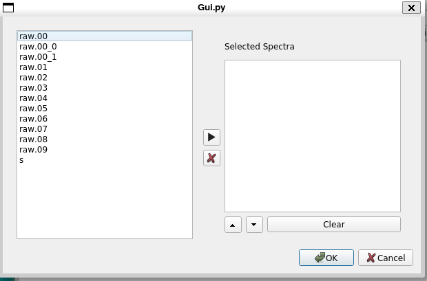
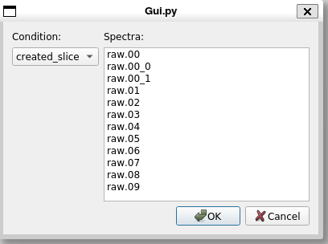

Provide site root to javascript 

 Work around some values being stored in localStorage wrapped in quotes 

 Set the theme before any content is loaded, prevents flash 

 Hide / unhide sidebar before it is displayed 

1. [[**1.** Chapter 1 - Introduction|https://github.com/FRIBDAQ/docs/tree/main/rustogramer/chapter_1.md]]
2. 1. [[**1.1.** How to use this book|https://github.com/FRIBDAQ/docs/tree/main/rustogramer/chap1_1.md]]
3. [[**2.** Chapter 2 - Preparing data for Rustogramer|https://github.com/FRIBDAQ/docs/tree/main/rustogramer/chapter_2.md]]
4. 1. [[**2.1.** The FRIB analysis pipeline|https://github.com/FRIBDAQ/docs/tree/main/rustogramer/chap2_1.md]]
   2. [[**2.2.** Format of data Rustogramer accepts|https://github.com/FRIBDAQ/docs/tree/main/rustogramer/chap2_2.md]]
5. [[**3.** Chapter 3 - Running Rustogramer|https://github.com/FRIBDAQ/docs/tree/main/rustogramer/chapter_3.md]]
6. [[**4.** Chapter 4 - Using the Rustogramer GUI|https://github.com/FRIBDAQ/docs/tree/main/rustogramer/chapter_4.md]]
7. 1. [[**4.1.** The Spectra Tab|https://github.com/FRIBDAQ/docs/tree/main/rustogramer/chap4_1.md]]
   2. [[**4.2.** The Parameters Tab|https://github.com/FRIBDAQ/docs/tree/main/rustogramer/chap4_2.md]]
   3. [[**4.3.** The Variables Tab|https://github.com/FRIBDAQ/docs/tree/main/rustogramer/chap4_3.md]]
   4. [[**4.4.** The Gate Tab|https://github.com/FRIBDAQ/docs/tree/main/rustogramer/chap4_4.md]]
   5. [[**4.5.** The BindSets Tab|https://github.com/FRIBDAQ/docs/tree/main/rustogramer/chap4_bindsets.md]]
   6. [[**4.6.** The File Menu|https://github.com/FRIBDAQ/docs/tree/main/rustogramer/chap4_5.md]]
   7. [[**4.7.** The Data Source Menu|https://github.com/FRIBDAQ/docs/tree/main/rustogramer/chap4_6.md]]
   8. [[**4.8.** The Filters Menu|https://github.com/FRIBDAQ/docs/tree/main/rustogramer/chap4_filters.md]]
   9. [[**4.9.** The Spectra Menu|https://github.com/FRIBDAQ/docs/tree/main/rustogramer/chap4_7.md]]
   10. [[**4.10.** The Gate Menu|https://github.com/FRIBDAQ/docs/tree/main/rustogramer/chap4_8.md]]
8. [[**5.** Chapter 5 - Using CutiePie to display histograms|https://github.com/FRIBDAQ/docs/tree/main/rustogramer/chapter_5.md]]
9. [[**6.** Chapter 6 - the REST interface|https://github.com/FRIBDAQ/docs/tree/main/rustogramer/chapter_6.md]]
10. 1. [[**6.1.** Tcl REST interface|https://github.com/FRIBDAQ/docs/tree/main/rustogramer/chap6_1.md]]
   2. [[**6.2.** Python REST interface|https://github.com/FRIBDAQ/docs/tree/main/rustogramer/chap6_2.md]]
11. [[**7.** Chapter 7 - Reference material|https://github.com/FRIBDAQ/docs/tree/main/rustogramer/chapter7.md]]
12. 1. [[**7.1.** Command Line Options|https://github.com/FRIBDAQ/docs/tree/main/rustogramer/chap7_1.md]]
   2. [[**7.2.** REST requests and responses|https://github.com/FRIBDAQ/docs/tree/main/rustogramer/chap7_2.md]]
   3. 1. [[**7.2.1.** Response format|https://github.com/FRIBDAQ/docs/tree/main/rustogramer/chap7_2_responses.md]]
      2. [[**7.2.2.** /spectcl/parameter requests|https://github.com/FRIBDAQ/docs/tree/main/rustogramer/chap7_2_parameter.md]]
      3. [[**7.2.3.** /spectcl/rawparameter requests|https://github.com/FRIBDAQ/docs/tree/main/rustogramer/chap7_2_rawparameter.md]]
      4. [[**7.2.4.** /spectcl/gate requests|https://github.com/FRIBDAQ/docs/tree/main/rustogramer/chap7_2_gates.md]]
      5. [[**7.2.5.** /spectcl/spectrum requests|https://github.com/FRIBDAQ/docs/tree/main/rustogramer/chap7_2_spectrum.md]]
      6. [[**7.2.6.** /spectcl/attach requests|https://github.com/FRIBDAQ/docs/tree/main/rustogramer/chap7_2_attach.md]]
      7. [[**7.2.7.** /spectcl/analyze requests|https://github.com/FRIBDAQ/docs/tree/main/rustogramer/chap7_2_analyze.md]]
      8. [[**7.2.8.** /spectcl/apply requests|https://github.com/FRIBDAQ/docs/tree/main/rustogramer/chap7_2_apply.md]]
      9. [[**7.2.9.** /spectcl/ungate requests|https://github.com/FRIBDAQ/docs/tree/main/rustogramer/chap7_2_ungate.md]]
      10. [[**7.2.10.** /spectcl/channel requests|https://github.com/FRIBDAQ/docs/tree/main/rustogramer/chap7_2_channel.md]]
      11. [[**7.2.11.** /spectcl/evbunpack requests|https://github.com/FRIBDAQ/docs/tree/main/rustogramer/chap7_2_evbunpack.md]]
      12. [[**7.2.12.** /spectcl/filter requests|https://github.com/FRIBDAQ/docs/tree/main/rustogramer/chap7_2_filter.md]]
      13. [[**7.2.13.** /spectcl/fit requests|https://github.com/FRIBDAQ/docs/tree/main/rustogramer/chap7_2_fit.md]]
      14. [[**7.2.14.** /spectcl/fold requests|https://github.com/FRIBDAQ/docs/tree/main/rustogramer/chap7_2_fold.md]]
      15. [[**7.2.15.** /spectcl/integrate requests|https://github.com/FRIBDAQ/docs/tree/main/rustogramer/chap7_2_integrate.md]]
      16. [[**7.2.16.** /spectcl/shmem requests|https://github.com/FRIBDAQ/docs/tree/main/rustogramer/chap7_2_shmem.md]]
      17. [[**7.2.17.** /spectcl/sbind requests|https://github.com/FRIBDAQ/docs/tree/main/rustogramer/chap7_2_sbind.md]]
      18. [[**7.2.18.** /spectcl/unbind requests|https://github.com/FRIBDAQ/docs/tree/main/rustogramer/chap7_2_ubind.md]]
      19. [[**7.2.19.** /spectcl/mirror requests|https://github.com/FRIBDAQ/docs/tree/main/rustogramer/chap7_2_mirror.md]]
      20. [[**7.2.20.** /spectcl/pman requests|https://github.com/FRIBDAQ/docs/tree/main/rustogramer/chap7_2_pman.md]]
      21. [[**7.2.21.** /spectcl/project requests|https://github.com/FRIBDAQ/docs/tree/main/rustogramer/chap7_2_project.md]]
      22. [[**7.2.22.** /spectcl/psuedo requests|https://github.com/FRIBDAQ/docs/tree/main/rustogramer/chap7_2_pseudo.md]]
      23. [[**7.2.23.** /spectcl/rootree requests|https://github.com/FRIBDAQ/docs/tree/main/rustogramer/chap7_2_roottree.md]]
      24. [[**7.2.24.** /spectcl/script requests|https://github.com/FRIBDAQ/docs/tree/main/rustogramer/chap7_2_script.md]]
      25. [[**7.2.25.** /spectcl/treevariable requests|https://github.com/FRIBDAQ/docs/tree/main/rustogramer/chap7_2_treevariable.md]]
      26. [[**7.2.26.** /spectcl/version requests|https://github.com/FRIBDAQ/docs/tree/main/rustogramer/chap7_2_version.md]]
      27. [[**7.2.27.** /spectcl/exit requests|https://github.com/FRIBDAQ/docs/tree/main/rustogramer/chap7_2_exit.md]]
      28. [[**7.2.28.** /spectcl/ringformat requests|https://github.com/FRIBDAQ/docs/tree/main/rustogramer/chap7_2_ringformat.md]]
      29. [[**7.2.29.** /spectcl/specstats requests|https://github.com/FRIBDAQ/docs/tree/main/rustogramer/chap7_2_specstats.md]]
      30. [[**7.2.30.** /spectcl/swrite requests|https://github.com/FRIBDAQ/docs/tree/main/rustogramer/chap7_2_swrite.md]]
      31. [[**7.2.31.** /spectcl/sread requests|https://github.com/FRIBDAQ/docs/tree/main/rustogramer/chap7_2_sread.md]]
      32. [[**7.2.32.** /spectcl/trace requests|https://github.com/FRIBDAQ/docs/tree/main/rustogramer/chap7_2_trace.md]]
   4. [[**7.3.** Shared memory Mirror service|https://github.com/FRIBDAQ/docs/tree/main/rustogramer/chap7_mirror.md]]
   5. [[**7.4.** Tcl REST reference|https://github.com/FRIBDAQ/docs/tree/main/rustogramer/chap7_3.md]]
   6. [[**7.5.** Python REST reference|https://github.com/FRIBDAQ/docs/tree/main/rustogramer/chap7_4.md]]
   7. [[**7.6.** Looking at the Rustogramer internals documentation|https://github.com/FRIBDAQ/docs/tree/main/rustogramer/chap7_5.md]]
   8. [[**7.7.** Schema of configuration files|https://github.com/FRIBDAQ/docs/tree/main/rustogramer/chap7_6.md]]
   9. [[**7.8.** Format of JSON Spectrum contents files|https://github.com/FRIBDAQ/docs/tree/main/rustogramer/chap7_7.md]]
13. [[**8.** Appendix I - Installing Rustogramer|https://github.com/FRIBDAQ/docs/tree/main/rustogramer/apppendix_1.md]]

 Track and set sidebar scroll position 

**

**

- Light
- Rust
- Coal
- Navy
- Ayu

**

# Rustogramer User Guide

[[**|https://github.com/FRIBDAQ/docs/tree/main/rustogramer/print.md]]

 Apply ARIA attributes after the sidebar and the sidebar toggle button are added to the DOM 

# [The Spectra Menu](#the-spectra-menu)

Many of the items on the `Spectra` menu are available on the `Spectra` tab and `File` menu.
THey are grouped here to make it unecessary to switch tabs to access them:

- [Save spectrum contents.](#save-spectrum-contents)
- [Read spectrum file](#read-spectrum-file)
- [Clear All](#clear-all)
- [Create](#create)
- [Delete](#delete)
- [Apply Gate](#apply-gate)

## [Save Spectrum Contents.](#save-spectrum-contents)

This allows you to save the contents of one or more spectra to file.
See [[The file  menu|https://github.com/FRIBDAQ/docs/tree/main/rustogramer/./chap4_5.md#file-save-spectrum-contents]] for a description of the user interface behind this.

## [Read Spectrum File](#read-spectrum-file)

Allows you to read a file that contains the contents of one or more spectra.  See
[[The file maneu|https://github.com/FRIBDAQ/docs/tree/main/rustogramer/./chap4_5.md#file-read-spectrum-contents]] for a description of the user interface behind this.

## [Clear all](#clear-all)

Clears the contents of all spectra.  All spectrum channels are set to zero.

## [Create](#create)

Allows you to create one or more spectra.  The spectrum editor tabbed widget is displayed.  When you are done creating the spectra you want, click `Ok` to dismiss the dialog.  A section of the Spectra Tab page describes how to use the [[spectrum editors|https://github.com/FRIBDAQ/docs/tree/main/rustogramer/./chap4_1.md#the-spectrum-editors]]

## [Delete](#delete)

Allows you to delete one or more spectra.   You can select the spectra to delete using:

Simply select spectra (you can select more than one at a time). And click the `>` button to add it to the editable list box.  When the listbox contains the spectra you want to delete; click `Ok` to delete those spectra.

Improvements are planned to the spectrum selection  see issue [#170](https://github.com/FRIBDAQ/rustogrammer/issues/170)

You can achieve the same effect in the Spectra tab using the [[Delete Button|https://github.com/FRIBDAQ/docs/tree/main/rustogramer/./chap4_1.md#the-button-bar]] on the Spectra tab button bar after selecting the spectra you want deleted from the spectrum listing in that tab.

## [Apply Gate](#apply-gate)

Allows you to apply a gate/condition to one or more spectra;

Select the condition on the left and select however many spectra you want (selections need not be contiguous) on the right and click `Ok` to apply the gate to the selected spectra.

 Mobile navigation buttons 
[[**|https://github.com/FRIBDAQ/docs/tree/main/rustogramer/chap4_filters.md]]
[[**|https://github.com/FRIBDAQ/docs/tree/main/rustogramer/chap4_8.md]]

[[**|https://github.com/FRIBDAQ/docs/tree/main/rustogramer/chap4_filters.md]]
[[**|https://github.com/FRIBDAQ/docs/tree/main/rustogramer/chap4_8.md]]

 Custom JS scripts
