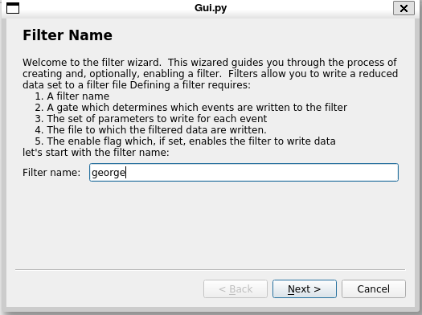
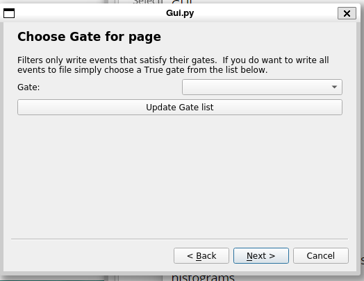
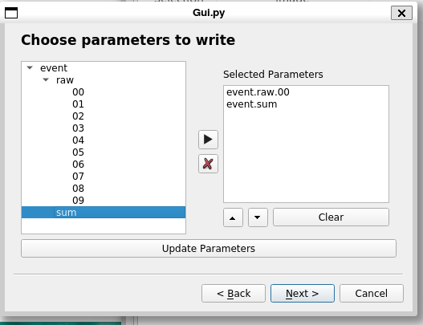
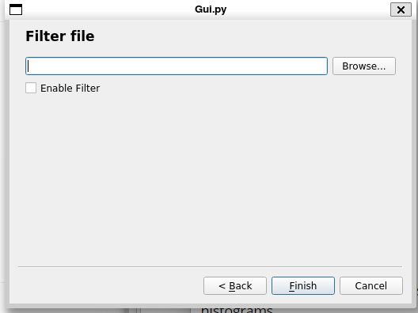
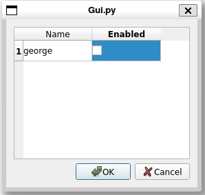

Provide site root to javascript 

 Work around some values being stored in localStorage wrapped in quotes 

 Set the theme before any content is loaded, prevents flash 

 Hide / unhide sidebar before it is displayed 

1. [**1.** Chapter 1 - Introduction](https://github.com/FRIBDAQ/docs/tree/main/rustogramer/chapter_1.md)
2. 1. [**1.1.** How to use this book](https://github.com/FRIBDAQ/docs/tree/main/rustogramer/chap1_1.md)
3. [**2.** Chapter 2 - Preparing data for Rustogramer](https://github.com/FRIBDAQ/docs/tree/main/rustogramer/chapter_2.md)
4. 1. [**2.1.** The FRIB analysis pipeline](https://github.com/FRIBDAQ/docs/tree/main/rustogramer/chap2_1.md)
   2. [**2.2.** Format of data Rustogramer accepts](https://github.com/FRIBDAQ/docs/tree/main/rustogramer/chap2_2.md)
5. [**3.** Chapter 3 - Running Rustogramer](https://github.com/FRIBDAQ/docs/tree/main/rustogramer/chapter_3.md)
6. [**4.** Chapter 4 - Using the Rustogramer GUI](https://github.com/FRIBDAQ/docs/tree/main/rustogramer/chapter_4.md)
7. 1. [**4.1.** The Spectra Tab](https://github.com/FRIBDAQ/docs/tree/main/rustogramer/chap4_1.md)
   2. [**4.2.** The Parameters Tab](https://github.com/FRIBDAQ/docs/tree/main/rustogramer/chap4_2.md)
   3. [**4.3.** The Variables Tab](https://github.com/FRIBDAQ/docs/tree/main/rustogramer/chap4_3.md)
   4. [**4.4.** The Gate Tab](https://github.com/FRIBDAQ/docs/tree/main/rustogramer/chap4_4.md)
   5. [**4.5.** The BindSets Tab](https://github.com/FRIBDAQ/docs/tree/main/rustogramer/chap4_bindsets.md)
   6. [**4.6.** The File Menu](https://github.com/FRIBDAQ/docs/tree/main/rustogramer/chap4_5.md)
   7. [**4.7.** The Data Source Menu](https://github.com/FRIBDAQ/docs/tree/main/rustogramer/chap4_6.md)
   8. [**4.8.** The Filters Menu](https://github.com/FRIBDAQ/docs/tree/main/rustogramer/chap4_filters.md)
   9. [**4.9.** The Spectra Menu](https://github.com/FRIBDAQ/docs/tree/main/rustogramer/chap4_7.md)
   10. [**4.10.** The Gate Menu](https://github.com/FRIBDAQ/docs/tree/main/rustogramer/chap4_8.md)
8. [**5.** Chapter 5 - Using CutiePie to display histograms](https://github.com/FRIBDAQ/docs/tree/main/rustogramer/chapter_5.md)
9. [**6.** Chapter 6 - the REST interface](https://github.com/FRIBDAQ/docs/tree/main/rustogramer/chapter_6.md)
10. 1. [**6.1.** Tcl REST interface](https://github.com/FRIBDAQ/docs/tree/main/rustogramer/chap6_1.md)
   2. [**6.2.** Python REST interface](https://github.com/FRIBDAQ/docs/tree/main/rustogramer/chap6_2.md)
11. [**7.** Chapter 7 - Reference material](https://github.com/FRIBDAQ/docs/tree/main/rustogramer/chapter7.md)
12. 1. [**7.1.** Command Line Options](https://github.com/FRIBDAQ/docs/tree/main/rustogramer/chap7_1.md)
   2. [**7.2.** REST requests and responses](https://github.com/FRIBDAQ/docs/tree/main/rustogramer/chap7_2.md)
   3. 1. [**7.2.1.** Response format](https://github.com/FRIBDAQ/docs/tree/main/rustogramer/chap7_2_responses.md)
      2. [**7.2.2.** /spectcl/parameter requests](https://github.com/FRIBDAQ/docs/tree/main/rustogramer/chap7_2_parameter.md)
      3. [**7.2.3.** /spectcl/rawparameter requests](https://github.com/FRIBDAQ/docs/tree/main/rustogramer/chap7_2_rawparameter.md)
      4. [**7.2.4.** /spectcl/gate requests](https://github.com/FRIBDAQ/docs/tree/main/rustogramer/chap7_2_gates.md)
      5. [**7.2.5.** /spectcl/spectrum requests](https://github.com/FRIBDAQ/docs/tree/main/rustogramer/chap7_2_spectrum.md)
      6. [**7.2.6.** /spectcl/attach requests](https://github.com/FRIBDAQ/docs/tree/main/rustogramer/chap7_2_attach.md)
      7. [**7.2.7.** /spectcl/analyze requests](https://github.com/FRIBDAQ/docs/tree/main/rustogramer/chap7_2_analyze.md)
      8. [**7.2.8.** /spectcl/apply requests](https://github.com/FRIBDAQ/docs/tree/main/rustogramer/chap7_2_apply.md)
      9. [**7.2.9.** /spectcl/ungate requests](https://github.com/FRIBDAQ/docs/tree/main/rustogramer/chap7_2_ungate.md)
      10. [**7.2.10.** /spectcl/channel requests](https://github.com/FRIBDAQ/docs/tree/main/rustogramer/chap7_2_channel.md)
      11. [**7.2.11.** /spectcl/evbunpack requests](https://github.com/FRIBDAQ/docs/tree/main/rustogramer/chap7_2_evbunpack.md)
      12. [**7.2.12.** /spectcl/filter requests](https://github.com/FRIBDAQ/docs/tree/main/rustogramer/chap7_2_filter.md)
      13. [**7.2.13.** /spectcl/fit requests](https://github.com/FRIBDAQ/docs/tree/main/rustogramer/chap7_2_fit.md)
      14. [**7.2.14.** /spectcl/fold requests](https://github.com/FRIBDAQ/docs/tree/main/rustogramer/chap7_2_fold.md)
      15. [**7.2.15.** /spectcl/integrate requests](https://github.com/FRIBDAQ/docs/tree/main/rustogramer/chap7_2_integrate.md)
      16. [**7.2.16.** /spectcl/shmem requests](https://github.com/FRIBDAQ/docs/tree/main/rustogramer/chap7_2_shmem.md)
      17. [**7.2.17.** /spectcl/sbind requests](https://github.com/FRIBDAQ/docs/tree/main/rustogramer/chap7_2_sbind.md)
      18. [**7.2.18.** /spectcl/unbind requests](https://github.com/FRIBDAQ/docs/tree/main/rustogramer/chap7_2_ubind.md)
      19. [**7.2.19.** /spectcl/mirror requests](https://github.com/FRIBDAQ/docs/tree/main/rustogramer/chap7_2_mirror.md)
      20. [**7.2.20.** /spectcl/pman requests](https://github.com/FRIBDAQ/docs/tree/main/rustogramer/chap7_2_pman.md)
      21. [**7.2.21.** /spectcl/project requests](https://github.com/FRIBDAQ/docs/tree/main/rustogramer/chap7_2_project.md)
      22. [**7.2.22.** /spectcl/psuedo requests](https://github.com/FRIBDAQ/docs/tree/main/rustogramer/chap7_2_pseudo.md)
      23. [**7.2.23.** /spectcl/rootree requests](https://github.com/FRIBDAQ/docs/tree/main/rustogramer/chap7_2_roottree.md)
      24. [**7.2.24.** /spectcl/script requests](https://github.com/FRIBDAQ/docs/tree/main/rustogramer/chap7_2_script.md)
      25. [**7.2.25.** /spectcl/treevariable requests](https://github.com/FRIBDAQ/docs/tree/main/rustogramer/chap7_2_treevariable.md)
      26. [**7.2.26.** /spectcl/version requests](https://github.com/FRIBDAQ/docs/tree/main/rustogramer/chap7_2_version.md)
      27. [**7.2.27.** /spectcl/exit requests](https://github.com/FRIBDAQ/docs/tree/main/rustogramer/chap7_2_exit.md)
      28. [**7.2.28.** /spectcl/ringformat requests](https://github.com/FRIBDAQ/docs/tree/main/rustogramer/chap7_2_ringformat.md)
      29. [**7.2.29.** /spectcl/specstats requests](https://github.com/FRIBDAQ/docs/tree/main/rustogramer/chap7_2_specstats.md)
      30. [**7.2.30.** /spectcl/swrite requests](https://github.com/FRIBDAQ/docs/tree/main/rustogramer/chap7_2_swrite.md)
      31. [**7.2.31.** /spectcl/sread requests](https://github.com/FRIBDAQ/docs/tree/main/rustogramer/chap7_2_sread.md)
      32. [**7.2.32.** /spectcl/trace requests](https://github.com/FRIBDAQ/docs/tree/main/rustogramer/chap7_2_trace.md)
   4. [**7.3.** Shared memory Mirror service](https://github.com/FRIBDAQ/docs/tree/main/rustogramer/chap7_mirror.md)
   5. [**7.4.** Tcl REST reference](https://github.com/FRIBDAQ/docs/tree/main/rustogramer/chap7_3.md)
   6. [**7.5.** Python REST reference](https://github.com/FRIBDAQ/docs/tree/main/rustogramer/chap7_4.md)
   7. [**7.6.** Looking at the Rustogramer internals documentation](https://github.com/FRIBDAQ/docs/tree/main/rustogramer/chap7_5.md)
   8. [**7.7.** Schema of configuration files](https://github.com/FRIBDAQ/docs/tree/main/rustogramer/chap7_6.md)
   9. [**7.8.** Format of JSON Spectrum contents files](https://github.com/FRIBDAQ/docs/tree/main/rustogramer/chap7_7.md)
13. [**8.** Appendix I - Installing Rustogramer](https://github.com/FRIBDAQ/docs/tree/main/rustogramer/apppendix_1.md)

 Track and set sidebar scroll position 

**

**

- Light
- Rust
- Coal
- Navy
- Ayu

**

# Rustogramer User Guide

[**](https://github.com/FRIBDAQ/docs/tree/main/rustogramer/print.md)

 Apply ARIA attributes after the sidebar and the sidebar toggle button are added to the DOM 

# [The Filters Menu (SpecTcl Only).](#the-filters-menu-spectcl-only)

As we have described in [our documentation of the Data Source->Filter file](https://github.com/FRIBDAQ/docs/tree/main/rustogramer/./chap4_6.md#data-source-filter-file-spectcl-only) menu  SpecTcl an write filtered event data files.  See that section for more information about what filter files are and pointers to SpecTcl documentation on filter files.   The `Filters` menu provides:

- The ability to create filters via a [filter wizard](#filter-filter-wizard).
- The ability to [control which filters are enabled](#filter-enabledisable-filters); enabled filters write data.
- Another menu entry to [attach a filter file](#filter-read-filter-files) for analyais.

Note again, that these menu entries are only available with SpecTcl and on rustogramer, the Filter menu itself will ont be present.

## [Filter->Filter Wizard](#filter-filter-wizard)

Creating a filter is a multi-step process.  The filter wizard leads you through the process of:

- [Naming the filter](#naming-the-filter)
- [Selecting, if desired, a gate](#selecting-the-filter-gate) to determine which events are written to the  filter file.
- [Choosing the parameters](#selecting-the-parameters-to-output) to write for each event that makes the gate true.
- [Choosing the file](#choosing-the-output-file) to which filter data will be written and whether the filter should be created
  enabled.

The next subsections will look at each of these steps, showing you the Wizard GUI for each step:

### [Naming the filter.](#naming-the-filter)

THe firs step of the filter wizard:

Describes the process of making a filter and presents you with an editable text input in which you can type the filter's name.  Filter names must be unique.

When you are satisfied with your filter name, click the `Next >` button.

### [Selecting the filter gate](#selecting-the-filter-gate)

A filter is gated.   Only events that make the filter true are written to the output file.  This allows you to do things like write only events with a specific particle ID for example.  The second stage of the filter wizard prompts you for a filter gate:

Select a gate from the pull down:

- If you've updated the gates your gate may not be visible. Clicking the `Update Gate list` button, will then update the list of gates that populate the gate chooser pull-down.
- If you want all events to be written, create and select a `True` gate as the filter gate.

When you hvae the desired gate selected, click the `Next >` Button.

### [Selecting the parameters to output.](#selecting-the-parameters-to-output)

Only a subset of parameters need to be written to filter files.  The next stop provides a parameter chooser/editable list to allow you to choose the parameters you want output:

Improvements to this stage of the GUI are planned see Issue [#169](https://github.com/FRIBDAQ/rustogrammer/issues/169) for more information.   When the parameters you want written are all in the editable list box, click the `Next >` button to advance to the last stage of the wizard.

### [Choosing the output file.](#choosing-the-output-file)

The final step of the filter creation process is to specify where the filtered data will be written and, optionally to enable the filter.

Only enabled filters will actually write data.

## [Filter->Enable/Disable Filters](#filter-enabledisable-filters)

This menu entry allows you to enable and disable filters.  It brings up this dialog:

The table has a line per filter.  The left column are filter names and the right columns checkboxes.  Check the boxes for the filters you want enbled then click the `Ok` button to apply your selections.

## [Filter->Read Filter Files](#filter-read-filter-files)

This menu command allows you to attach a filter file.  THe mechanics of this are described in
the [Data Source Menu](https://github.com/FRIBDAQ/docs/tree/main/rustogramer/chap4_6.md#data-source-filter-file-spectcl-only).

 Mobile navigation buttons 
[**](https://github.com/FRIBDAQ/docs/tree/main/rustogramer/chap4_6.md)
[**](https://github.com/FRIBDAQ/docs/tree/main/rustogramer/chap4_7.md)

[**](https://github.com/FRIBDAQ/docs/tree/main/rustogramer/chap4_6.md)
[**](https://github.com/FRIBDAQ/docs/tree/main/rustogramer/chap4_7.md)

 Custom JS scripts
