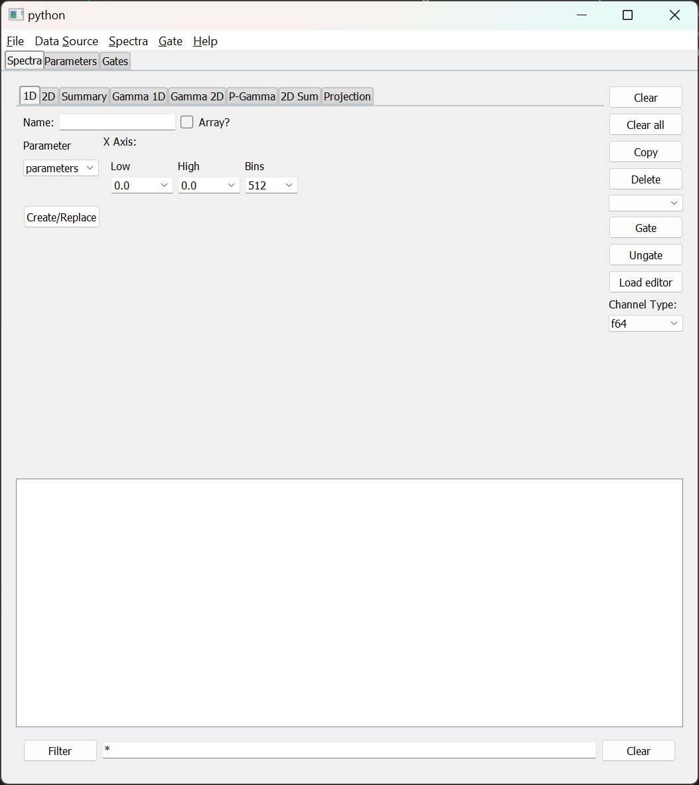

Provide site root to javascript 

 Work around some values being stored in localStorage wrapped in quotes 

 Set the theme before any content is loaded, prevents flash 


 Hide / unhide sidebar before it is displayed 


1. [[chapter_1]]
2. 1. [[chap1_1]]
3. [[chapter_2]]
4. 1. [[chap2_1]]
   2. [[chap2_2]]
5. [[chapter_3]]
6. [[chapter_4]]
7. 1. [[chap4_1]]
   2. [[chap4_2]]
   3. [[chap4_3]]
   4. [[chap4_4]]
   5. [[chap4_bindsets]]
   6. [[chap4_5]]
   7. [[chap4_6]]
   8. [[chap4_filters]]
   9. [[chap4_7]]
   10. [[chap4_8]]
8. [[chapter_5]]
9. [[chapter_6]]
10. 1. [[chap6_1]]
   2. [[chap6_2]]
11. [[chapter7]]
12. 1. [[chap7_1]]
   2. [[chap7_2]]
   3. 1. [[chap7_2_responses]]
      2. [[chap7_2_parameter]]
      3. [[chap7_2_rawparameter]]
      4. [[chap7_2_gates]]
      5. [[chap7_2_spectrum]]
      6. [[chap7_2_attach]]
      7. [[chap7_2_analyze]]
      8. [[chap7_2_apply]]
      9. [[chap7_2_ungate]]
      10. [[chap7_2_channel]]
      11. [[chap7_2_evbunpack]]
      12. [[chap7_2_filter]]
      13. [[chap7_2_fit]]
      14. [[chap7_2_fold]]
      15. [[chap7_2_integrate]]
      16. [[chap7_2_shmem]]
      17. [[chap7_2_sbind]]
      18. [[chap7_2_ubind]]
      19. [[chap7_2_mirror]]
      20. [[chap7_2_pman]]
      21. [[chap7_2_project]]
      22. [[chap7_2_pseudo]]
      23. [[chap7_2_roottree]]
      24. [[chap7_2_script]]
      25. [[chap7_2_treevariable]]
      26. [[chap7_2_version]]
      27. [[chap7_2_exit]]
      28. [[chap7_2_ringformat]]
      29. [[chap7_2_specstats]]
      30. [[chap7_2_swrite]]
      31. [[chap7_2_sread]]
      32. [[chap7_2_trace]]
   4. [[chap7_mirror]]
   5. [[chap7_3]]
   6. [[chap7_4]]
   7. [[chap7_5]]
   8. [[chap7_6]]
   9. [[chap7_7]]
13. [[apppendix_1]]


 Track and set sidebar scroll position 

**


**

- Light
- Rust
- Coal
- Navy
- Ayu


**


# Rustogramer User Guide


[[print]]


 Apply ARIA attributes after the sidebar and the sidebar toggle button are added to the DOM 

# [Chapter 4 - Using the Rustogramer GUI](#chapter-4---using-the-rustogramer-gui)


Rustogramer suplies a sample GUI that is based on the NSCLSpecTcl treegui with, what I think are, some improvements in how objects are creatd. The GUI is a sample of a REST client written in Python against the [[./chap6_2]].


If the envirionment variable `RUST_TOP` is defined to point to the top installation directory of Rustogramer, you can run the gui as follows:


```bash
$RUST_TOP/bin/gui [--host rghost] [[--port rest_port] | [--service rest_service] [--service-user rg_user]]

```


The gui supports the following command options


- `--host` specifies the host on which the rustogramer you want to control is running.  This defaults to `localhost` if not specified.
- One of two methods to specify the REST port that Rustogramer is using:
  - `--port` specifies the numeric port on which Rustogramer's REST server is listening.  This defaults to `8000` which is Rustogrammer's default REST port.
  - If rustogramer is using the NSCLDAQ port manager to advertise a service name:
    - `--service`  specifies the name of service rustogramer is advertising.
    - `--service-user` specifies the name of the user that rustogramer is running under.  This defaults to your login username and, in general, should not be used.


When connected to Rustogramer, the GUI will look like this:



Prior to describing each of the user interface elements let's look at a few features of this image.


- The menubar at the top of the window provides access to operations that are not as frequent as those available on the main window.  Note that the contents of the menubar depends on the actual application the GUI is connectec to.
- The tabs below the menu-bar provide access to the sections of functionality of the GUI.  Note that the set of tabs will, again, depend on the application the GUI is connected to.   For example, Rustogramer does not have TreeVariable like functionality as that capability is pushed back onto the code that prepares data-sets.  If connected to SpecTcl, however, a `Variables` tab will be present.
- Below the Tabs are controls for the things that Tab manages.  In the figure above, the `Spectra` tab is selected and shows a tabbed notebook that allows you to create and edit the definitions of Spectra as well as a filtered list of spectra and their applications.  More about this tab in the documentation [[./chap4_1]]
- Note that the only thing the `Help` menu provides is information about the program (the `About` menu command).


For information about the contents of each tab:


- [[./chap4_1]]
- [[./chap4_2]]
- [[./chap4_3]] (SpecTcl only).
- [[./chap4_4]]
- [[./chap4_bindsets]]


For information about the Menus:


- [[./chap4_5]]
- [[./chap4_6]]
- [[./chap4_filters]] (SpecTcl only).
- [[./chap4_7]]
- [[./chap4_8]]


The rustogramer GUI is now included in SpecTcl (as of version 7.0).  To use it you'll need to setup the ReST server as described in the CutiePie documentation.  You can then start the GUI from `SpecTclRC.tcl`
by adding the line:


```tcl
exec python3 $SpecTclHome/pythontree/Gui.py --port $HTTPDPort &

```


towards the end of that file.


 Mobile navigation buttons 
[[chapter_3]]
[[chap4_1]]


[[chapter_3]]
[[chap4_1]]


 Custom JS scripts
