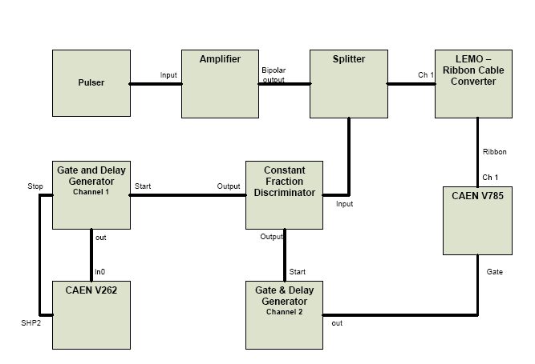
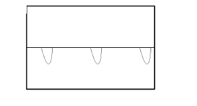
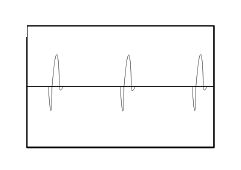
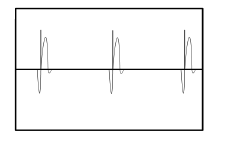
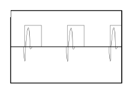

|  |  |  |
| --- | --- | --- |
| Using NCSL DAQ Software to Readout a
                CAEN V785 Peak-Sensing ADC |
| Prev |  | Next |

---

# Chapter 1. The electronics

The CAEN V785 is a 12 bit, 32-channel analog to digital converter that
returns a value related to the maximum voltage that occurs during the time
a gate is present. The input signal must be positive and less than 4V. The
V785 is a VME based module. For a complete understanding of the module
I suggest that you obtain a copy of the product manual, available as a PDF
at [http://www.caen.it/](http://www.caen.it/)

# 1.1. A minimal Electronics Setup

The following items will be needed to build our simple setup:

- CAEN V785 ADC module
- VME Crate
- SBS Bit3 PCI/VME bus interface
- NIM Crate
- NIM Spectroscopy amplifier of some sort
- NIM Discriminator
- Two channels of NIM Gate and delay generator
- NIM Signal splitter
- LEMO to Ribbon cable converter
- VME CAEN V262 I/O module
- Pulser
- 50ohm LEMO terminator
- An assortment of LEMO Cables
- A 34 conductor ribbon cable with 3M connectors on each end
- An oscilloscope

**Figure 1-1. A simple electronics setup for the CAEN V785**

Before starting be sure that you can secure all of these items, many are
available through the NSCL electronics pool. Figure 1-1 shows the complete
setup of the system, due to the varying amount of familiarity of readers to
the electronics, a brief description of the component and what the signal
coming out of it should look like will be given.

We will first look at the signal from the pulser. A pocket will work well for
this. A pocket pulsers will give a small negative pulse, but we will invert it
later. The signal directly from the pulser will look like figure 1-2 when viewed
on a scope. The pulser only works when terminated with 50 Ohms.

The pulser will run directly into a NIM based amplifier. This amplifer
serves two purposes. First it will amplify our signal helping it stand out
against any noise we might have in the channel. It will also invert the negative
pulser signal giving us the positive signal that is required by the V785. The
signal coming from the bi-polar output of the amplifier will look like figure
1-3. Adjust the gain on the amplifier until you output signal has an amplitude
of about 2V.

**Figure 1-2. Pulser Output Signal**

**Figure 1-3. Amplifier Output SIgnal**

After you are happy with the signal from the amplifier plug the bipolar
output into the splitter. The splitter will simply split the signal much like a
"T" but will keep the 50Ω termination needed by the pulser.

One of the splitter outputs will go into a LEMO to Ribbon Cable con-
verter. This can be either a NIM based module or a freestanding adapter.
Either way the function is simple and will allow you to put the signal onto a
flat ribbon cable to be plugged into the CAEN V785.

|  |  |
| --- | --- |
|  | Ribbon cable can difficult to work with because it is easy to get it
twisted and lose track, of which end is which. To avoid this look carefully
at the coloring on the cable you are using and be sure it is plugged in the
correct channel of the ADC. |

The other output from the splitter will go into a discriminator. This
could be either a leading edge or a constant fraction discriminator. The job
of the discriminator is determine when a signal has occurred and to put out
a logic signal when it does. The discriminator will have a threshold knob,
be sure that the threshold is set above any background noise that may be
present so that the discriminator only trips on the pulser signal. It will be
useful to look at the both the logic pulse and the signal from the amplifier
at the same time when setting the threshold value. Figure 1-4 shows what you
will see.

**Figure 1-4. Amplified Signal with Logic pulse**

When the threshold is set to a reasonable level, connect one of the dis-
criminator outputs to the start of one channel of your gate and delay gen-
erator. The gate and delay generator will generate a gate when it receives
a logic signal from the discriminator. When looking at the signal from the
amplifier and the gate at the same time on the scope, the signal pulse should
fall within the gate as seen in figure 1-5. If the gate is occurring too early you
can use the gate and delay generator to delay the gate or to make the gate
last longer. If the gate is too late you need to delay the signal pulse, that
can be done using a delay module, or by adding cable delay. When you are
happy with the gate timing, plug it into one of the LEMO connectors on the
CAEN V785 labeled gate, put a 50 Ohm terminator in the other one.

**Figure 1-5. Amplified Signal and Gate**

The second output of the discriminator will go to a second gate and delay
channel; this combined with the CAEN V262 will trigger the computer when
there is data on the V785. This channel will be run in latched mode meaning
that it will be given both a start and a stop signal for the gate. The output
signal will start being "true" when the start signal is received and stops
being "true" when the stop signal is received. The start signal is the signal
from the discriminator. The discriminator output will go to the IN0 of the
CAEN V262 I/O module. The stop signal is generated by the computer to
indicate it has responded to the trigger. That signal is present at the SHP2
output of the V262 and should be connected to the stop on the gate and
delay generator.

At this point your setup should be complete. Now is good time to make
sure that your setup is the same as Figure 1-1. If everything is setup correctly
the BUSY and DRDY lights on the V785 should be lit up.

|  |  |
| --- | --- |
|  | The setup shown in figure 1 does not have a dead time lockout, that
is it could try to process a second event while the computer is still busy. This
will not be a problem as long as source is a predictable as a pulser but would
be problematic if we replaced the pulser with a detector signal. |

---

|  |  |  |
| --- | --- | --- |
| Prev | Home | Next |
| Preface |  | Setting up the software |
