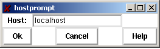
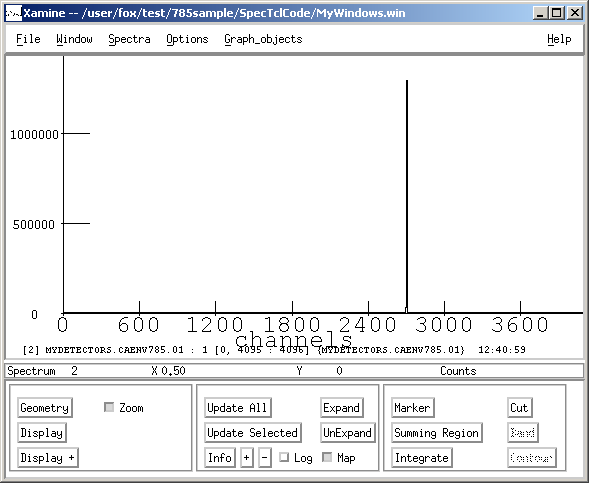

|  |  |  |
| --- | --- | --- |
| Using NCSL DAQ Software to Readout a
                CAEN V785 Peak-Sensing ADC |
| Prev |  | Next |

---

# Chapter 3. Testing and Running the Software.

Now let's put all the pieces together and test the system end-to-end.  We will:

- Start SpecTcl
- Reload our spectrum and window definition files into SpecTcl
- Connect SpecTcl to the online system so that it will
                  analyze data taken from our Readout program.
- Start the Readout Program
- Start a run in Readout
- Check that we see counts in our spectra in SpecTcl

First lets start SpecTcl and recover the definitions
        we made earlier.  With your working directory set ˜/experiment/spectcl,
        start SpecTcl by typing:
        **./SpecTcl**

Once all of the SpecTcl windows pop up, reload the
        spectrum configuration using:
        File->Restore...
        on the GUI window.  Next load the window definition file for Xamine by
        clicking:
        Window->Read Configuration....
        You should now have an array of spectra in the Xamine window,
        four rows, by eight columns, as before.

Now lets hook SpecTcl to the online system.  SpecTcl
        has a concept of data sources.  A data source is a source of event data that
        SpecTcl can histogram.  The Data Source
        menu on the SpecTcl Gui provides a selection of data source types.
        Click the
        Data Source->Online (spectrodaq)...
        menu item on the Gui window. This will bring up the dialog shown in the following figure.

**Figure 3-1. Online source host selection dialog**

The NSCL Data acquisition system is a distributed system.  It is therefore possible to
        histogram data on a system other than the one the Readout runs on.  In most
        real experiments at the NSCL, we do exactly that.  In this case, we will run
        SpecTcl and the readout program on the same system.
        Therefore the default host localhost is correct. Simply
        click the Ok button to connect to the online system.

Now we must start Readout and begin a run so there is data for SpecTcl
        to analyze.  With our current working directory set to
        cd ~/experiment/readout, start the readout program:
        **./Readout**.  When you get the prompt, type:
        **begin**.

The status line at the bottom of the SpecTcl GUI should
        reflect the number of buffers SpecTcl has analyzed and the analysis efficiency.
        SpecTcl is not allowed to dictate the data rate.  Therefore
        it only analyzes the fraction of the data it is able to keep up with.  The efficiency
        reflects that percentage.  When analyzing data from offline sources (e.g. event files),
        all data are analyzed, so the efficiency is 100%.

In the Xamine window, click the Update All
        button in the second box of buttons.  The histogram for the channel into which you have
        put the pulser should show a sharp peak.  If you double click this spectrum to zoom in,
        you should see something like this:

**Figure 3-2. Sample Pulser Peak**

By adjusting the pulse height you should be able to move this peak across the spectrum.
        By switching input channels you should be able to produce this peak in any of the
        histograms.

---

|  |  |  |
| --- | --- | --- |
| Prev | Home | Next |
| SpecTcl Histogramming Software |  | More information |
