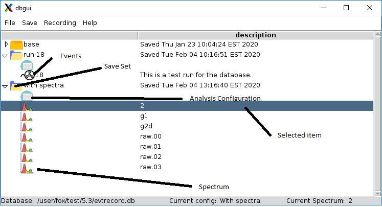

|  |  |  |
| --- | --- | --- |
| SpecTcl Sqlite3 interfaces |
| Prev |  | Next |


---

# <a name="AEN1440"></a>Chapter 7. The SpecTcl database GUI.

The SpecTcl database GUI provides a simple graphical user interface
        to the database.  It allows you to


- Create empty databases and access existing ones.
- View the contents of a database in a tree-like graphical
                form.
- Save configurations to and restore them from savesets.
- Save and store the contents of spectra to a save set.
- Initiate and end event recording.
- Specify auto save spectrum lists for event recording.
- Initiate and stop event playback from runs saved in a
                saveset.

You can use the GUI by adding the following lines to your
        SpecTclRC.tcl:

<a name="AEN1460"></a>**Example 7-1. Incorporating the database GUI in your SpecTcl**

```

lappend auto_path [file join $SpecTclHome TclLibs]
...
package require dbgui
        
```

With a database file open, the GUI might look like this:

<a name="AEN1464"></a>**Figure 7-1. The SpecTcl database GUi window**



Each saveset is shown as a folder.  Within open folders, the entities
        stored in the saveset are identified by various icons.
        These are describe in the figure.  Note that an item in the
        user interface may be selected by clicking it.  If an item
        is selected it is highlighted as shown.  The status line
        at the bottom of the window includes the database name,
        the name of the current configuration, the currently selected item and,
        not shown, a digital clock.

You interact with the graphical user interface via commands
        on its menubar and pop-up *context menus*
        accessed by right clicking on selected items in the
        main window of the GUI.

First we'll look at the menubar menus and their contents.
        Then we'll look at the context menus that are available.

# <a name="AEN1471"></a>7.1. The GUI Menubar

**File Menu. **
                The File menu has the following commands:


New...Prompts for the name of a new file.
                            The file will be initialized with the
                            schema needed to serve as a database file.
                            The resulting, presumably empty database will then be opened and
                            used as the current database.

Open...Prompts for the name of a file. The
                            selected file must be a previously initialized database
                            file.  The selected file is opened and
                            becomes the new database file.

The view of the current database is updated to reflect
                            all of the savesets in the file.

**The Save Menu. **
                This menu allows you to save various things into
                the database:


Configuration...Prompts for the name of a new save set
                            and saves the current SpecTcl analysis configuration
                            into that saveset.

Spectrum...Prompts for spectra to save. The
                            contents of the selected spectra are saved to the
                            current save set.  If there is no current savset,
                            An error dialog tells you that.

**Recording. **
                This menu supports various aspects of event recording
                into the database.


Enable RecordingThis checkbutton turns on or off event recording.
                            While event recording is active the main window
                            actions are disabled because event recording
                            locks the entire database.

Autosave spectra...Prompts for the spectra whose contents are automatically
                            saved at the end of a recorded run.

**Help. **
                The Help menu only contains
                the About...
                entry.  That entry pops up a message box that
                provides information about the GUI and its
                version.

---

|  |  |  |
| --- | --- | --- |
| Prev | Home | Next |
| SpecTcl API to the database. |  | Pop Up context menus |
